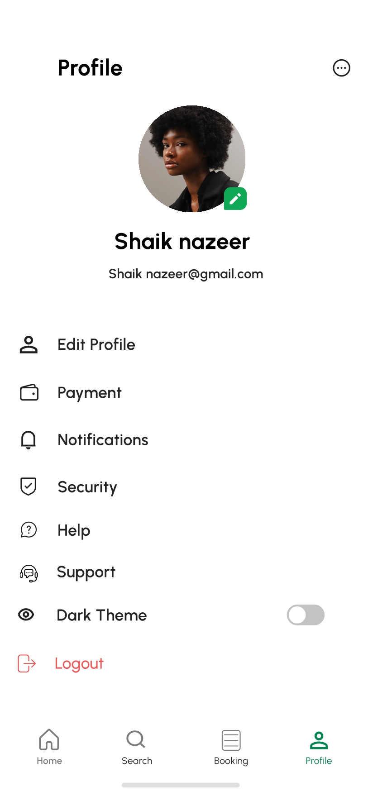
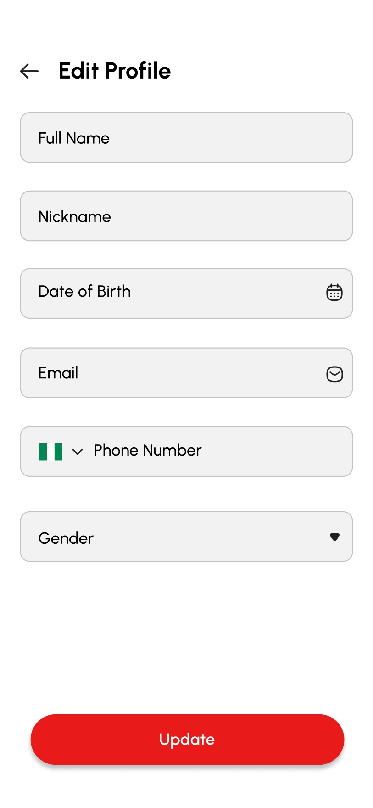
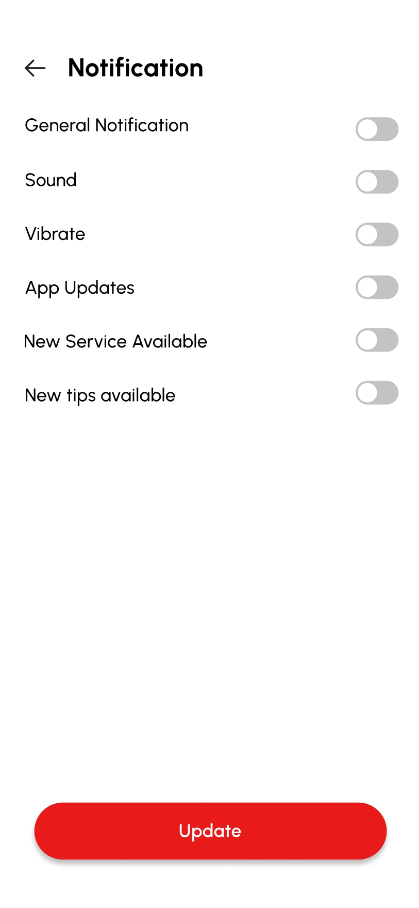
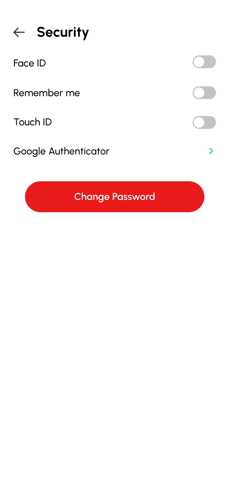
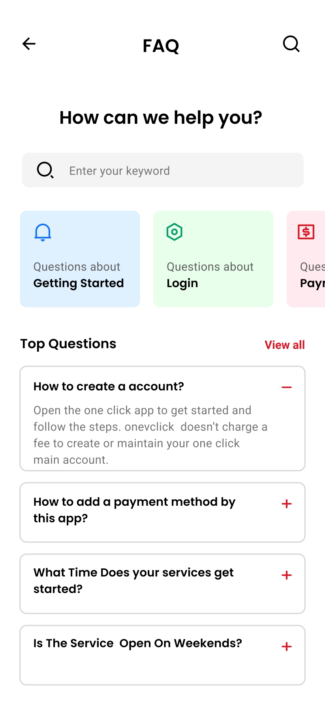
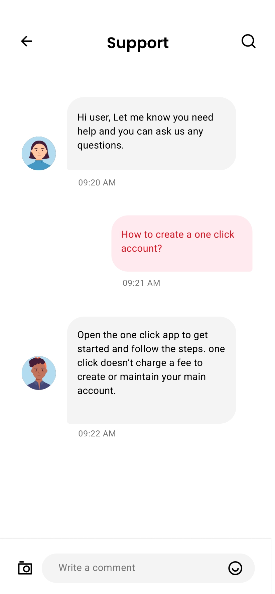

# Flutter_Dashboard
This repository contains the <a href="https://drive.google.com/file/d/1OVgz84ngsO-v8H7Dpi8tEEM0BNpA_aLH/view?usp=drive_link">File</a> for a Flutter application that serves as a Dashboard for managing user profiles. The application provides various sections including user profile management, editing profiles, security settings, help, and support functionalities.

### Screenshot

  
  
  

  
  
  

### Technologies Used
- Flutter

### Features
- User Profile Section:

View user profile information.
Update profile details such as name, email, and profile picture.

- Edit Profile Section:

Edit user profile information.
Update profile details such as name, email, and profile picture.

- Security Section:

Manage security settings such as password updates, two-factor authentication, etc.

- Help Section:

Access help documentation and resources.
Submit support tickets or inquiries.

- Support Section:

Contact support team for assistance.
Report issues or bugs encountered within the application.
